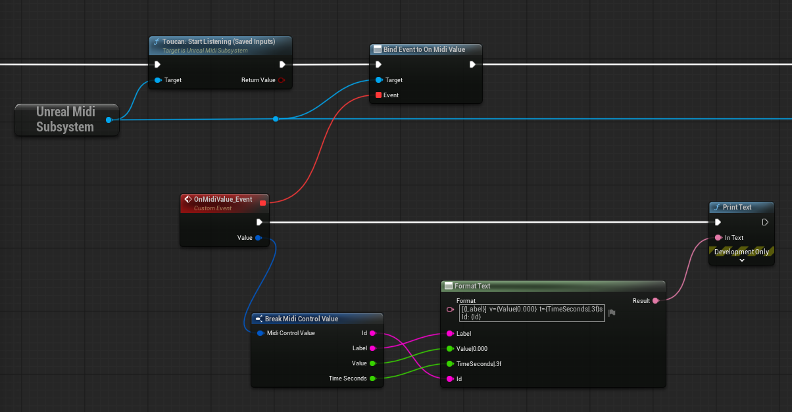

# UnrealMidi


## Introduction
UnrealMidi is an Unreal Engine plugin that brings hardware MIDI controllers into your project.
It lets you:
- Discover and select MIDI devices per-project.
- Stream CC, Note On/Off, Program Change, and SysEx into Unreal.
- Apply per-device filtering to tame jitter and ghost touches.
- Consume values in Blueprint or C++ via an engine subsystem and events.

Currently only tested on windows and preview of Unreal 5.7.0. Use a different RtMidi, setup to get it working in other OS's. 


## Dependencies
UnrealMidi vendors [RtMidi](https://github.com/thestk/rtmidi) directly in the plugin.


## How to use - script
1) Enable & pick your devices
    - Add the plugin to your project's `Plugin` folder.
    - Enable UnrealMidi in your project's plugin window.
    - Open the MIDI Controllers window (the plugin adds a button/tab in the editor).
    - Check the devices you want and click Save Selection.
    > **_Optional:_** Click the gear icon next to a device to tweak filtering and toggle debug prints.

2) Blueprint usage
    - In any Blueprint, use Get Engine Subsystem → UnrealMidiSubsystem.
    - Call StartListeningSavedInputs (or auto-start) once.
    - Bind to OnMidiValue (continuous/discrete: CC, Note, Program Change) and optionally OnMidiSysEx.
    - Each OnMidiValue event gives you:
    > `Id` — e.g. IN:MyDevice:CC:1:74
    `Label` — e.g. (CC ch1 #74, Note ch1 #60, Program ch1 #21)
    `Value` — 0..1 (buttons 0/1, notes 0/1, CC/PC scaled)
    `TimeSeconds` — timestamp



3) C++ usage (example)
```cpp
// In an Actor/Subsystem where you can access GEngine
#include "UnrealMidiSubsystem.h"
#include "Engine/Engine.h"

void AMyListener::BeginPlay()
{
    Super::BeginPlay();

    if (GEngine)
    {
        if (auto* Midi = GEngine->GetEngineSubsystem<UUnrealMidiSubsystem>())
        {
            // Start streaming from your saved input devices
            Midi->StartListeningSavedInputs();

            // Subscribe to value events
            Midi->OnMidiValue.AddLambda([](const FMidiControlValue& V)
            {
                // Example: react to CC74 on channel 1
                if (V.Id.Contains(TEXT(":CC:1:74")))
                {
                    UE_LOG(LogTemp, Log, TEXT("CC74 = %.3f (id=%s, t=%.3fs)"),
                        V.Value, *V.Id, V.TimeSeconds);
                }
            });

            // (Optional) SysEx
            Midi->OnMidiSysEx.AddLambda([](const FString& Device, const TArray<uint8>& Bytes)
            {
                UE_LOG(LogTemp, Log, TEXT("SysEx from %s, %d bytes"), *Device, Bytes.Num());
            });
        }
    }
}
```


### Notes & tips
- The plugin can auto-start listening on editor load. If you hot-plug devices, use Refresh in the picker or call StartListeningSavedInputs() again (you can also enable the built-in periodic hot-plug scan if you added it).
- Device selection is stored in your per-project user config. If a saved device is missing, the picker shows a red warning banner.
- The filter dialog (gear icon) lets you tune:
    - TEnter / TActive thresholds (Schmitt trigger)
    - Debounce time
    - Idle timeout
    - “Debug prints” (logs raw values/SysEx from this device)

## How to use - learn window
The plugin also provides means to map functions to the midi controls directly, but on a later moment by the user through a learn window.
Important scripts to enable this:
1. Learn Menu (Editor Window) — a UI (`SMidiMappingWindow`) to map functions to MIDI inputs.
2. Mapping Manager (`UMidiMappingManager`) — stores mappings and registered callable functions.
3. Event Router (`UMidiEventRouter`) — listens to incoming MIDI messages and triggers mapped actions.


Following is a guide so you can bind functions to this menu.

---
1) Registering Functions in Script
Before you can bind anything, you must register callable functions with the UMidiMappingManager.
Each function has a label, an internal ID, and a callback with this signature:
```cpp
void(const FString& Device, int32 Control, float Value, const FString& FunctionId)

// Example bind:
if (UMidiMappingManager* Manager = UMidiMappingManager::Get())
{
    FMidiRegisteredFunction F;
    F.Id = TEXT("Seq.StepForward");
    F.Label = F.Id;
    F.Callback.BindStatic(&USequencerControlSubsystem::OnMidi_StepForward);
    Manager->RegisterFunction(F.Label, F.Id, F.Callback);
}
```
---
2) Using the Learn Menu
Open the _MIDI Mapping_ window. Select a MIDI device that we want to bind to the functions. Each registered function is listed with buttons for Learn and Forget.
Click learn, and then touch a MIDI control. The function is now bound to the MIDI control.
